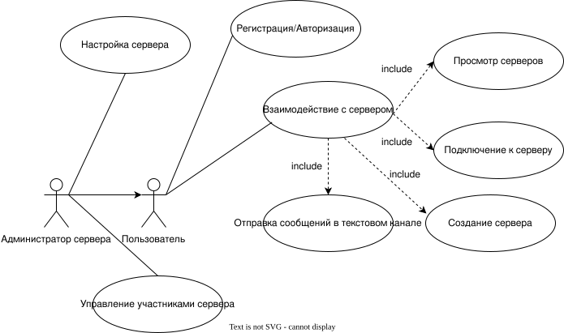
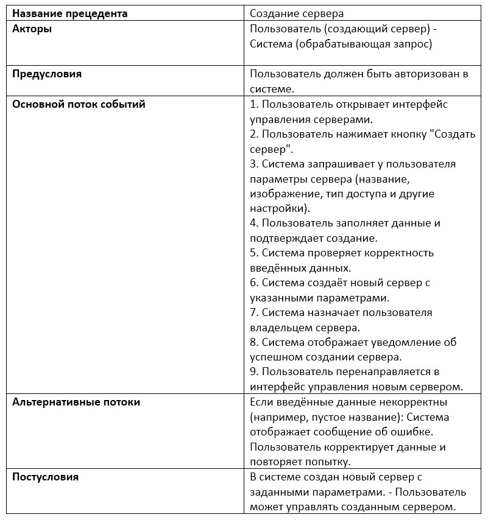
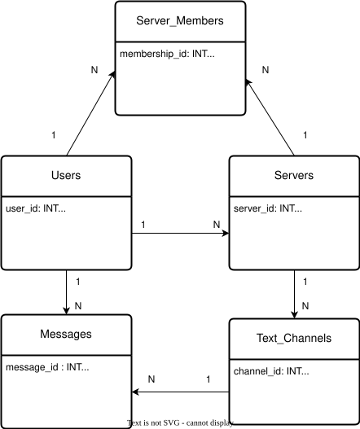
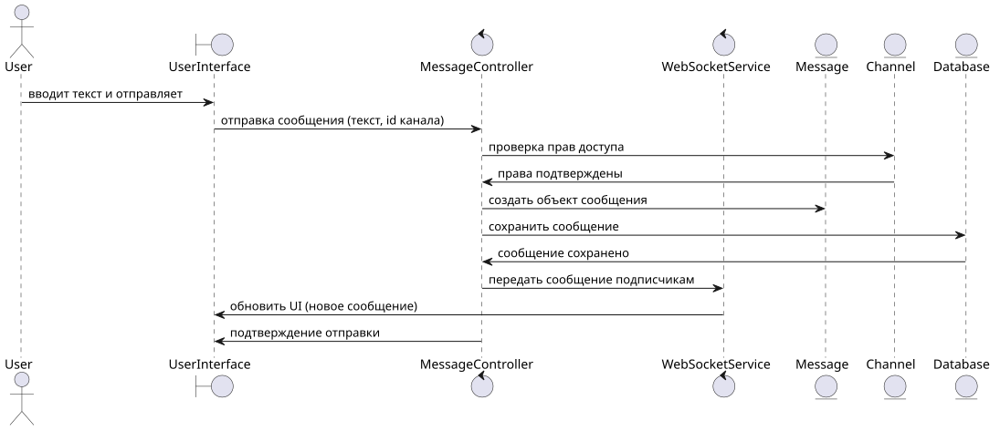

## 1. Диаграмма вариантов использования  
  
## 2. Пример сценария  
  
## 3. Диаграмма бизнес-классов  
  
## 4. Диаграмма последовательности: Отправка сообщения в текстовый канал
Граничные классы:UserInterface – пользовательский интерфейс.  
Управляющие классы (Control):  
MessageController – обрабатывает запросы на отправку сообщений.  
WebSocketService – отправляет сообщения подписанным клиентам.  
Классы-сущности (Entity):  
User – пользователь.    
Message – сообщение.  
Channel – текстовый канал.  
Database – хранилище сообщений. 
  
## 5. Диаграмма компонентов 

